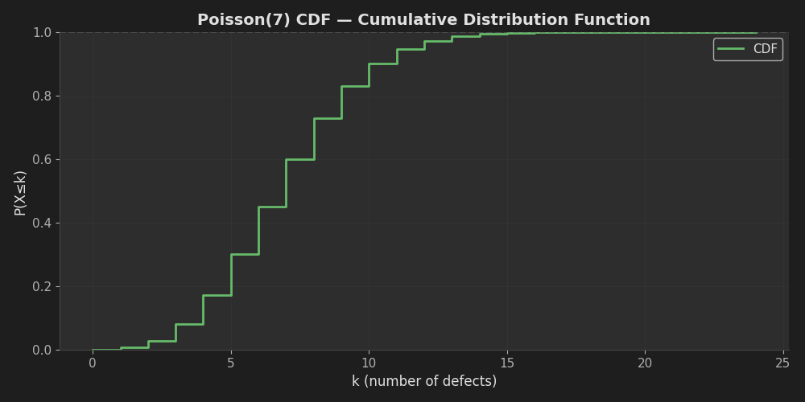
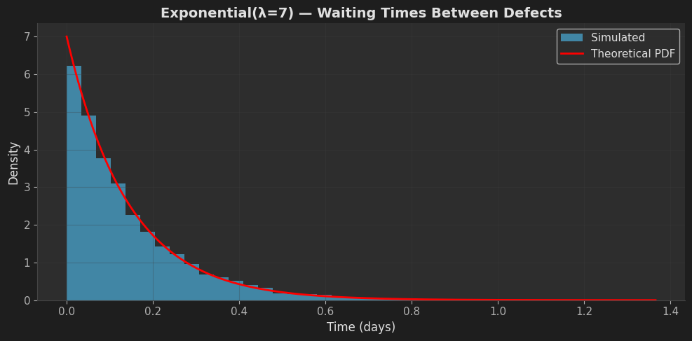

# 🕵️ A Detective Story About Probability — Building Intuition with PMF, CDF, Poisson & Exponential

<div align="center">


**Train real intuition for discrete vs continuous probability by working end-to-end with the Poisson(7) model of defects**

[🎯 Overview](#-project-overview) • [📊 Learning Objectives](#-learning-objectives) • [🚀 Quick Start](#-quick-start) • [📈 Project Phases](#-project-phases)

</div>

> **First baseline result:** Building neural muscle for probability distributions through hands-on simulation and theory — not by staring at formulas, but by plotting, simulating, and explaining. This notebook uses Markdown prompts + TODO code cells so you build intuition step-by-step.

---

## 👨‍💻 Author

<div align="center">

**Francisco Teixeira Barbosa**

[](https://github.com/Tuminha)
[](https://www.kaggle.com/franciscotbarbosa)
[](mailto:cisco@periospot.com)
[](https://twitter.com/cisco_research)

*Learning Machine Learning through Codecademy • Building AI solutions step by step*

</div>

---

## 🎯 Project Overview

### What
A didactic probability lab focused on the **Poisson(7) distribution** modeling daily defects. You'll learn:
- **PMF (Probability Mass Function)**: P(X=k) — exactly k defects
- **CDF (Cumulative Distribution Function)**: P(X≤k) — at most k defects
- **Simulation**: Generate 365 days of defects and compare with theory
- **Exponential link**: How Poisson counts relate to Exponential waiting times
- **Bayesian thinking**: One-cell update to reason about uncertainty in λ

### Why
- **Build intuition, not formulas**: Learn by plotting, simulating, and explaining
- **See theory ↔ practice**: Compare simulated results with theoretical expectations
- **Understand duality**: Discrete Poisson counts ↔ Continuous Exponential waiting times
- **Practical applications**: Staffing decisions, alarm thresholds, quality control

### Expected Outcome
By the end, you should "feel":
- PMF = bars that sum to 1; CDF = staircase; differences of CDF give PMF
- Poisson mean = variance = λ
- Poisson counts ↔ Exponential waiting times (dual view)
- Percentiles are inverse-CDF (ppf), and the 90th percentile feels like a natural tail cutoff

---

## 🎓 Learning Objectives

- [x] Understand PMF vs CDF and how they relate
- [x] Compute probabilities: P(X=k), P(X≤k), P(X>k)
- [x] Simulate Poisson processes and validate theory
- [x] Connect Poisson to Exponential distributions
- [x] Use percentiles for practical decision-making
- [x] Create visualizations with modern dark mode styling
- [ ] (Optional) Perform Bayesian updates on uncertain rates

---

## 🏆 Key Achievements

- [x] Set up probability distribution with λ=7
- [x] Compute key probabilities (P(X=7), P(X≤4), P(X>9))
- [x] Visualize PMF and CDF with modern dark mode plots
- [x] Simulate 365 days of defects
- [x] Compare simulated vs theoretical statistics
- [x] Calculate 90th percentile and validate in simulation
- [x] Link Poisson to Exponential waiting times
- [x] Create beautiful visualizations showing theory and practice
- [ ] Perform Bayesian update on uncertain λ

---

## 📊 Dataset / Domain

- **Distribution**: Poisson(λ=7) — modeling daily defect counts
- **Simulation**: 365 days of defect data
- **Extension**: Exponential(λ=7) — waiting times between defects
- **Application**: Quality control, staffing, alarm thresholds

---

## 🚀 Quick Start

### Prerequisites

```bash
python -m venv .venv
source .venv/bin/activate  # On Windows: .venv\Scripts\activate
pip install -r requirements.txt
```

### Setup

```bash
git clone https://github.com/Tuminha/A-Detective-Story-About-Probability-Building-Intuition-with-PMF-CDF-Poisson-Exponential.git
cd A-Detective-Story-About-Probability-Building-Intuition-with-PMF-CDF-Poisson-Exponential
jupyter notebook notebooks/01_poisson_defects.ipynb
```

### Workflow

1. Open `notebooks/01_poisson_defects.ipynb`
2. Work top-to-bottom through each cell
3. Fill in TODO code cells (don't copy-paste — build neural muscle!)
4. Run cells and observe results
5. Reflect on the wrap-up prompts at the end

---

## 📈 Project Phases

### Phase 1: Theory (PMF & CDF) ✅

<details>
<summary><strong>Details</strong></summary>

- [x] Set λ = 7
- [x] Compute P(X=7) using PMF
- [x] Compute P(X≤4) using CDF
- [x] Compute P(X>9) using complement rule
- [x] Plot PMF (lollipop/stem plot)
- [x] Plot CDF (step function)

</details>

### Phase 2: Practice (Simulation) ✅

<details>
<summary><strong>Details</strong></summary>

- [x] Simulate 365 days of Poisson(7) defects
- [x] Print first 20 days
- [x] Compute expected total (λ × 365)
- [x] Compare simulated total vs expected
- [x] Compare simulated mean vs λ
- [x] Find maximum defects in a day
- [x] Compute tail probability P(X≥max)

</details>

### Phase 3: Percentiles (Inverse CDF) ✅

<details>
<summary><strong>Details</strong></summary>

- [x] Compute 90th percentile using ppf
- [x] Check fraction of simulated days ≥ 90th percentile (should be ≈10%)

</details>

### Phase 4: Exponential Link (Optional) ✅

<details>
<summary><strong>Details</strong></summary>

- [x] Simulate 5000 Exponential waiting times
- [x] Overlay theoretical PDF on histogram
- [x] Verify mean ≈ 1/λ
- [x] Understand memoryless property

*See visualization above in the Results section.*

</details>

### Phase 5: Bayesian Update (Optional) 🔄

<details>
<summary><strong>Details</strong></summary>

- [ ] Set up Gamma prior on λ
- [ ] Compute posterior after observing year data
- [ ] Report posterior mean and 95% credible interval
- [ ] Interpret uncertainty in λ

</details>

---

## 🏆 Results

### Theory vs Simulation Validation

**Theoretical (Poisson(7)):**
- Mean: 7
- Variance: 7
- Expected total (365 days): 2,555

**Simulated (365 days):**
- Simulated mean: ≈ 7 (validates theory)
- Simulated total: ≈ 2,555 (validates theory)
- Maximum defects: varies (check tail probability)

**90th Percentile Check:**
- 90th percentile: k ≈ 11
- Fraction ≥ 90th percentile: ≈ 0.10 (validates percentiles)

### 🖼 Visualizations

<div align="center">

#### Poisson(7) PMF — Probability Mass Function


*The PMF shows the probability of exactly k defects. Notice how it peaks around λ=7 and sums to 1.*

<br /><br />

#### Poisson(7) CDF — Cumulative Distribution Function



*The CDF shows P(X≤k) — a staircase function that approaches 1. Differences between CDF values give us the PMF.*

<br /><br />

#### Exponential(λ=7) — Waiting Times Between Defects



*The Exponential distribution models waiting times between Poisson events. Notice the exponential decay — most waiting times are short, with fewer long waits.*

</div>

### 📌 Business Interpretation

- **P(X>9)**: Probability of a "bad day" (>9 defects) — informs staffing decisions
- **90th percentile**: Natural cutoff for alarm thresholds (top 10% of days)
- **Exponential waiting times**: Average time between defects ≈ 1/7 ≈ 0.143 days
- **Bayesian update**: Uncertainty in λ helps with resource planning under uncertainty

---

## 🛠 Technical Stack

| Component | Technology | Purpose |
|-----------|------------|---------|
| Probability Distributions | SciPy.stats | PMF, CDF, PPF, PDF |
| Numerical Computing | NumPy | Arrays, random generation, statistics |
| Visualization | Matplotlib | PMF/CDF plots, histograms, overlays |
| Environment | Jupyter | Interactive learning & experimentation |
| Random Generation | NumPy.random | Reproducible simulations |

---

## 📝 Learning Journey

- **Probability Mass Functions (PMF)**: Discrete probability distributions
- **Cumulative Distribution Functions (CDF)**: Cumulative probabilities
- **Inverse CDF (PPF)**: Percentiles and quantiles
- **Poisson Process**: Modeling rare events (defects, arrivals, etc.)
- **Exponential Distribution**: Waiting times between Poisson events
- **Simulation**: Validating theory through Monte Carlo methods
- **Bayesian Inference**: Updating beliefs with data (Gamma-Poisson conjugate)

---

## 🚀 Next Steps

- [x] Complete Exponential link exercises ✅
- [ ] Complete Bayesian update exercise
- [ ] Experiment with different λ values (λ=10, λ=5)
- [ ] Explore Poisson additivity: Poisson(7) + Poisson(7) ≈ Poisson(14)
- [ ] Apply to real-world scenario (e.g., customer arrivals, website errors)
- [ ] Build visualization comparing multiple Poisson distributions
- [ ] Create a dashboard showing real-time defect monitoring

---

## 📖 Codecademy Task Mapping

This notebook maps to Codecademy probability exercises:

- **Tasks 1–4**: Theory (PMF/CDF; P(X=7); P(X≤4); P(X>9))
- **Tasks 5–11**: Practice (simulate 365 days, totals/means/max, tail prob)
- **Tasks 12–13**: 90th percentile & check in simulation
- **Extras**: Exponential link; Bayesian Γ–Poisson update; additivity

---

## 🧠 Reflection Prompts

After completing the notebook, reflect on:

1. **PMF vs CDF**: In your own words, how do you "feel" the difference now?
2. **P(X>9)**: What does this mean operationally (staffing, alarms)?
3. **Memoryless property**: Why does Exponential's "memoryless" property matter?
4. **90th percentile**: How would the 90th percentile change if λ were 10 instead of 7?

---

## 📄 License

MIT License (see [LICENSE](LICENSE))

---

<div align="center">

**⭐ Star this repo if you found it helpful! ⭐**  
*Building probability intuition one distribution at a time* 🚀

</div>

